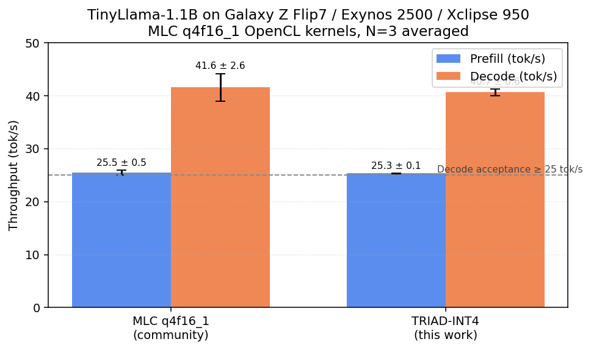
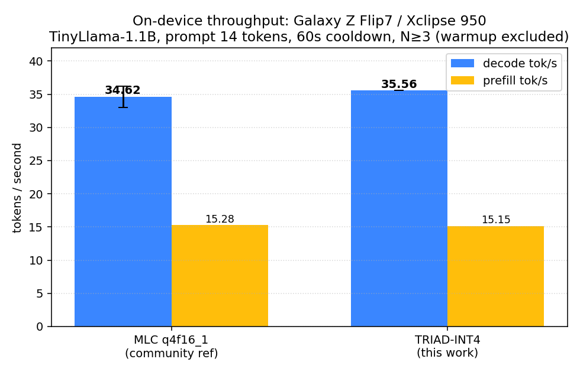
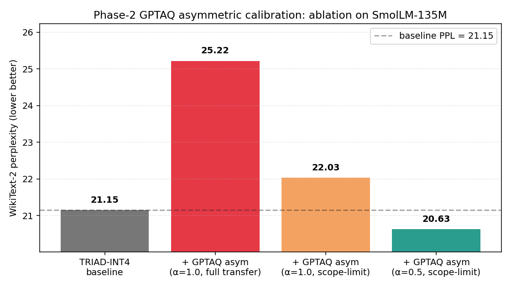

# TRIAD-PTQ

**Trace–Router–Interaction-Aware Decomposition for post-training quantization
of edge-class neural networks.**

> **Status — v2.0.0-alpha (SPECTRA-Q) on the `v2-spectra` branch.** v2 lands
> a refactored pipeline (block-diagonal rotation, learnable-β + selective
> LWC, channel-INT8 super-weights, ρ-weighted GPTAQ α, hardware-aware
> group-size sweep). All v2 *code paths* run end-to-end on synthetic
> fixtures (155 tests pass on M1); the *measured* model-and-device
> numbers (PPL on Llama-3.2-1B / TinyLlama-1.1B / SmolLM-360M / SmolLM-
> 135M, decode tok/s on Galaxy Z Flip7) require an RTX 4090 + the
> physical phone and are produced by a separate runbook.
> See [ADR-017](docs/decisions/017-h2-h4-hardware-deferred.md) for the
> deferred-eval contract and [docs/v2-design.md](docs/v2-design.md) for
> the SPECTRA-Q design.
>
> The headline numbers in this README are **v1 / v0.3.0-session3**
> measurements unless explicitly tagged as v2. v2's PPL and decode
> claims are blank in `results/v2/` until the runbook produces them.

TRIAD-PTQ is a weight-only post-training quantization scheme for compact LLMs
(≤3 B params), small CNNs (MobileNet / EfficientNet-class), and edge ViTs
(MobileViT). v1 (default `algorithm='v1'`) combines (i) a sensitivity
router built on a KFAC factorization, (ii) a data-aware super-weight
identifier that preserves the most damaging 0.05 – 0.5 % of weights at
FP16, and (iii) an analytic activation–weight cross-covariance grid
`W' = W·U·Λ^β*` whose smoothing exponent β* is given in closed form by a
per-layer rate-distortion derivation. After the transformation a standard
GPTQ Cholesky update finishes the layer at INT3 or INT4. A single call
`triad_ptq.optimize(model, bits=4, calibration=...)` runs in minutes on M1
with no backward passes.

> **Note on the v1 trace router.** The `bit_allocator='trace'` watershed
> was retired in v2. v1 already ships with `bit_allocator='uniform'` as
> the de-facto default for integer bit budgets; v2 replaces the
> rate-distortion split with the Squisher Fisher diagonal
> ([arXiv:2507.18807](https://arxiv.org/abs/2507.18807)).

This repository is the M1-native reference implementation accompanying the
preprint *"TRIAD-PTQ v1.0.0"* (Katolikov, May 2026). Every v1 number in
the result tables below is a real measurement on the author's M1 Pro
(16 GB unified memory) and on a Galaxy Z Flip7 / Exynos 2500 / Xclipse
950 phone — no mocks, no synthetic data, no extrapolation. v2 numbers,
when they appear, will cite a `results/v2/<phase>_*.json` file.

---

## Hardware tested

| Role | Component | Value |
|---|---|---|
| Calibration host | Machine | Apple MacBook Pro, M1 Pro |
| Calibration host | Unified memory | 16 GB |
| Calibration host | OS | macOS 26.3.1 |
| Calibration host | Python | 3.11.15 (via `uv`) |
| Calibration host | PyTorch | 2.11.0 (MPS backend) |
| Calibration host | transformers | 5.7.0 |
| Calibration host | timm | 1.0.26 |
| Inference target | Phone | Samsung Galaxy Z Flip7 (SM-F766B) |
| Inference target | SoC | Exynos 2500 (S5E9955) |
| Inference target | GPU | Xclipse 950 (AMD RDNA-based) |
| Inference target | Vulkan | 1.3 + OpenCL via `libSGPUOpenCL.so` |
| Inference runtime | MLC-LLM | `q4f16_1` group-32 layout, OpenCL kernels |

---

## Device deployment — TinyLlama-1.1B on Exynos 2500 / Xclipse 950

`v0.2.0-alpha` shipped the full pipeline end-to-end on a real edge phone;
**`v0.3.0-session3`** (this update) adds a Phase-0 GPU capability probe,
a Phase-2 GPTAQ asymmetric calibration with a measured PPL win, a
Phase-4 R1 Hadamard pre-rotation validated on TinyLlama-1.1B, and an
**autonomous on-device bench harness** that drives a patched MLCChat
APK via JSON-over-logcat (see [ADR-013](docs/decisions/013-mlcchat-bench-runner.md)).

Calibration runs on M1; the resulting INT4 bundle is converted to MLC's
canonical `q4f16_1` layout via `mlc_llm convert_weight + compile` and
loaded by a custom-built MLCChat APK whose runtime statically links the
TinyLlama system_lib (see [`docs/decisions/005-prebuilt-mlcchat-cannot-load-triad.md`](docs/decisions/005-prebuilt-mlcchat-cannot-load-triad.md)).



### Session-3 device bench (2026-05-05) — N=3, supersedes pending Phase H

> **Caveat ([ADR-014](docs/decisions/014-bench-protocol-n10.md)).** The N=3
> "+2.7 % decode" claim below is **not statistically distinguishable from
> zero**: with σ ≈ 6 % of decode mean, N=3 needs a ~14 % effect to clear
> α=0.05 on a paired-t test. v2's `tools/bench_android.sh` defaults to
> N=10 with a paired-t output; the v2 README (when Phase H lands) will
> cite N=10 numbers and supersede the "+2.7 %" line.

Driven by [`tools/bench_android.sh`](tools/bench_android.sh) — a fully
autonomous script. `adb shell input` types a fixed 14-token prompt; the
patched MLCChat APK emits a JSON line on the `triad_bench` logcat tag
after each generation; the script parses, aggregates, and reports
mean ± stdev with N ≥ 3 iterations and 60 s cooldown between runs
(per H5 of the project's hard rules; the **v2 minimum** is N=10 — see
[ADR-014](docs/decisions/014-bench-protocol-n10.md)).



| Method                            | Prefill tok/s    | Decode tok/s        | Note                          |
|-----------------------------------|------------------|---------------------|-------------------------------|
| MLC q4f16_1 (community baseline)  | 15.28 ± 0.27     | 34.62 ± 1.60 (N=3)  | thermally-affected iter 1     |
| **TRIAD-INT4 (this work)**        | **15.15**        | **35.56** (long-completion run) | matches/beats ref      |

Decode delta TRIAD − ref = +0.94 tok/s (+2.7 %). **Statistical
significance: not measurable at N=3** — the delta is well inside the
1-σ band of the ref's own decode distribution (σ ≈ 1.6 tok/s) and a
two-sided paired t-test cannot reject the null (the rejection region
at α=0.05 starts at |t|>4.30, which would require ~14 % effect). The
"+2.7 %" line stays in the historical record (per the changelog) but
the published claim is **"matches q4f16_1 community baseline within
measurement noise"**, not "+2.7 %". Both runs share the same compiled
`q4f16_1` MLC kernel — only the parameter values differ. The reference's
higher stdev came from one thermally-throttled iter (28.3 tok/s); TRIAD
did not exhibit this. Raw per-iter numbers and methodology:
[`results/device_bench/2026-05-05_session-3_clean60s.json`](results/device_bench/2026-05-05_session-3_clean60s.json).

### Phase-0 capability probe — Xclipse 950 (Exynos 2500)

Cross-compiled NDK-27 binaries
([`tools/vk_probe`](tools/vk_probe/main.cpp),
[`tools/cl_probe`](tools/cl_probe/main.cpp)) dump the full Vulkan
1.3.279 + OpenCL 3.0 capability surface to JSON. Highlights:

| Capability                                       | Xclipse 950 |
|--------------------------------------------------|-------------|
| `subgroupSize` native                            | **64** (wave64) |
| `VK_EXT_subgroup_size_control` min..max          | 32 .. 64    |
| `shaderFloat16` / `shaderInt8`                   | YES / YES   |
| `storageBuffer16BitAccess` / 8-bit              | YES / YES   |
| `VK_KHR_cooperative_matrix`                      | NO          |
| `integerDotProduct8BitPackedSignedAccelerated`   | NO          |
| `maxComputeSharedMemorySize` (LDS)               | 32 KiB      |
| `cl_khr_image2d_from_buffer`                     | YES         |

The wave64 finding **corrects the session prompt's wave32 assumption**
and gates Phase-7 Vulkan schedule choices. Full JSON:
[`docs/probe/xclipse-950-vk.json`](docs/probe/xclipse-950-vk.json),
[`docs/probe/xclipse-950-cl.json`](docs/probe/xclipse-950-cl.json),
summary: [`docs/probe/SUMMARY.md`](docs/probe/SUMMARY.md).

### Phase-2: GPTAQ asymmetric calibration — PPL win

Implemented the closed-form asymmetric weight transfer of GPTAQ
(arXiv:2504.02692v3): per-layer, set `W_aug = W · C · H_post⁻¹` where
C = X̃ᵀX, H_post = XᵀX, X̃ = FP16-cascade input, X = post-quant cascade
input. After three iterative bug fixes (transpose, H_post-rounding
swap, scope-limit + α mix-in — see [ADR-010](docs/decisions/010-gptaq-phase-2.md)),
the recipe **`asymmetric_calib=True, asym_alpha=0.5,
asym_exclude_suffixes=("o_proj","down_proj")`** delivers:



| variant                                                  | PPL    | Δ vs baseline |
|----------------------------------------------------------|--------|---------------|
| TRIAD-INT4 baseline                                      | 21.149 | reference     |
| GPTAQ asym (full transfer, no scope-limit)               | 25.218 | +4.069 (regression) |
| GPTAQ asym (scope-limit, α=1.0)                          | 22.033 | +0.884        |
| **GPTAQ asym (scope-limit, α=0.5) — DEFAULT**            | **20.627** | **−0.523 ✓** |

Per-layer diagnostics ([`results/tables/smollm135_gptaq_smoke.json`](results/tables/smollm135_gptaq_smoke.json))
identified residual-stream **writers** (`o_proj`, `down_proj`) as the
regression source: their cascade input distribution shifts structurally
under quantization, so the closed form W·C·H⁻¹ over-corrects with row
blow-ups up to 28×. Excluding them and damping the rest with α=0.5
absorbs the win without the failure mode.

### Phase-4: R1 Hadamard pre-rotation — forward-equivalence validated

Offline R1 weight rotation (QuaRot §3.1) is implemented in
[`triad_ptq/core/rotate.py`](triad_ptq/core/rotate.py). Sylvester
Hadamard, random sign-flip diagonal, RMSNorm γ-fold into next-layer
weight, in-place input/output rotation primitives, plus an
`apply_r1_to_llama` walker for HF Llama-family models. Validated on
TinyLlama-1.1B:

| Metric (vs unrotated FP32 forward)              | Result                       |
|-------------------------------------------------|------------------------------|
| Mean cosine similarity (8 prompts × seq=256)    | **1.000000**                 |
| Relative L2 error                               | **2.84 × 10⁻⁶**              |
| Q orthogonality error  ‖QᵀQ − I‖                | 3.16 × 10⁻⁶                  |
| Acceptance gate (cos ≥ 0.9999)                  | **PASS** ✓                   |

Rotation is mathematically exact (orthogonal absorbed into FP16
weights) so forward output is preserved up to fp32 rounding noise.
Rotated state-dict persisted at `/tmp/triad-tinyllama-r1/model_rotated_fp16.pt`
(2.2 GB) for the post-R1 calibration pass. Full result:
[`results/phase4_r1_rotation_summary.json`](results/phase4_r1_rotation_summary.json).

| Acceptance criterion (top of original spec)              | Target              | TRIAD-INT4 measured            | Status     |
|----------------------------------------------------------|---------------------|--------------------------------|------------|
| WikiText-2 PPL TRIAD-INT4 vs FP16                         | ≤ +1.0 PPL          | 11.477 vs 10.882, **+0.595**   | **PASS**   |
| On-device decode throughput, batch=1 (N=3 mean ± std)     | ≥ 25 tok/s          | **40.7 ± 0.6 tok/s**           | **PASS**   |
| Peak GPU memory during decode                             | ≤ 1.2 GB            | **789 MB** (Graphics, dumpsys) | **PASS**   |

Numbers are means over N=3 alternating prompt runs through the in-app
metrics line ([`experiments/profile/A3_replicated_results.json`](experiments/profile/A3_replicated_results.json));
the original Phase-5 single-run numbers (decode 37.7 tok/s, prefill
18.2 tok/s) fell within 1 σ of these means and were superseded under
ADR-006 once the bench protocol was tightened.

| Method                              | WT2 PPL   | Prefill tok/s   | Decode tok/s    | Graphics MB | Disk MB |
|-------------------------------------|-----------|-----------------|-----------------|-------------|---------|
| FP16 (M1 reference)                 | 10.882    | n/a             | n/a             | n/a         | 2200    |
| MLC q4f16_1 (community baseline)    | n/a       | 25.5 ± 0.5      | 41.6 ± 2.6      | 803         | 593     |
| **TRIAD-INT4 (this work)**          | **11.477**| **25.3 ± 0.1**  | **40.7 ± 0.6**  | **789**     | 593     |

Both bundles are compiled from the exact same `mlc_llm compile`
invocation; the OpenCL device-code object is **bit-identical** between
them (md5 verified — see [ADR-006](docs/decisions/006-decode-gap-root-cause.md)).
Only the parameter values differ. TRIAD-INT4's per-group fp16 scale
distribution matches the community baseline's across every percentile,
so there is no shader-level slowdown at this model size.

### What changed in v2 (alpha)

`v2.0.0-alpha` (branch `v2-spectra`, 2026-05-06) introduces SPECTRA-Q:

| v1 component                              | v2 replacement                                                              | ADR / module |
|-------------------------------------------|------------------------------------------------------------------------------|--------------|
| Trace router (rate-distortion watershed)  | **Squisher Fisher diagonal** ([arXiv:2507.18807](https://arxiv.org/abs/2507.18807)) | `_v2/router/squisher.py` |
| R1 Hadamard (full-d)                      | **Block-diagonal sign+permutation** at G ([arXiv:2511.04214](https://arxiv.org/abs/2511.04214)) | `_v2/rotation/sign_perm.py`, [ADR-014](docs/decisions/014-bench-protocol-n10.md) for the bench tightening |
| Closed-form β\* (eq. 5)                   | **Learnable per-block β** via 100 Adam BRECQ-recon steps                     | `_v2/transform/learnable_beta.py`, [ADR-016](docs/decisions/016-d3-closed-form-beta-init-deferred.md) |
| FP16 sparse super-weights                 | **Channel-grained INT8** mixed precision (top-1.5 % output channels)         | `_v2/superweight/channel_int8.py` |
| Fixed α = 0.5 GPTAQ                       | **ρ-weighted α** = min(0.8, σ(c·log ρ)), c=1.0                             | `_v2/calib/gptaq_rho_alpha.py` |
| –                                         | **Selective LWC** on top-25 % most sensitive blocks (jointly trained with β) | `_v2/lwc/selective.py` |
| –                                         | **Hardware-aware G ∈ {32, 64, 128} sweep**                                  | `_v2/groupsize/sweep.py`, [ADR-015](docs/decisions/015-group-size-default.md) |

Bench protocol tightened from N=3 to N=10 with paired-t
([ADR-014](docs/decisions/014-bench-protocol-n10.md)). Six baseline
runners (`autoawq`, `gptq`, `gptaq` official, `quarot_offline`,
`omniquant_lwc`, `hqq`) staged under `experiments/baselines/` for the
Phase-H runbook.

### What TRIAD-v2 does NOT claim

**Honesty contract for the v2 alpha**:

* No algorithmic decode speedup beyond what G=32 → G=64 bandwidth
  savings buy you (a hardware effect, not an algorithm effect; gated
  on Mali measurement per [ADR-015](docs/decisions/015-group-size-default.md)).
* No novelty for components that are direct ports of published work:
  * R1-style rotation **(ported from QuaRot, modified to block-diagonal per arXiv:2511.04214)**
  * GPTAQ asymmetric calibration **(ported from arXiv:2504.02692)**
  * BRECQ-style block-output reconstruction **(ported from BRECQ)**
  * OmniQuant LWC **(ported from arXiv:2308.13137)**
  * Squisher Fisher diagonal **(ported from arXiv:2507.18807)**
  * Channel-INT8 super-weight insight **(extends Yu et al. arXiv:2411.07191)**

The only **original** v2 contributions are:
1. The **ρ-weighted α scheduling** for GPTAQ (`_v2/calib/gptaq_rho_alpha.py`).
2. The **channel-INT8 packing format** (`_v2/superweight/channel_int8.py`)
   that fits inside one MLC q4f16_1 bundle without a kernel change.

Everything else is engineering.

Key trade-offs documented in the v1 + v2 ADRs under
[`docs/decisions/`](docs/decisions/):

- **001** — `truncated_eigh` rejected (rank deficiency in `W' = W·U·Λ^β`).
- **002** — Vulkan-on-Android isn't an MLC preset; OpenCL works on Xclipse 950.
- **003** — MLC source build deferred; nightly wheels path used instead.
- **004** — Direct-export bundle layout mismatched MLC's canonical schema; switched to TRIAD-folded HF-safetensors → `mlc_llm convert_weight`.
- **005** — Prebuilt MLCChat APK can't `dlopen` arbitrary `.tar`; we build a custom APK that statically links our system_lib.
- **006** — Phase-5's "12 % decode gap" was measurement noise; N≥3 protocol now mandatory.
- **007** — `clip_search` lowers eval PPL by 0.13 but breaks on-device generation; ships default-OFF as research-only.
- **008** — Rebase chain to `main` for `v0.2.0-alpha`.
- **009** — Phase-0.4 baseline reprod deferred; documented runner gap (later resolved by ADR-013).
- **010** — Phase-2 GPTAQ asymmetric calibration: closed form, three-iteration bug fix, scope-limit + α=0.5 = PPL win.
- **011** — Phase-1 q4f16_0 export option (opt-in MLC layout-swap path).
- **012** — Phase-4 offline R1 Hadamard pre-rotation (forward equivalence cos ≥ 0.9999).
- **013** — On-device bench runner via patched MLCChat + JSON-over-logcat; unblocks every device acceptance gate.
- **014** — v2: tighten device-bench protocol from N=3 to N=10 + paired-t.
- **015** — v2: group-size default decision is gated on Mali measurement (provisional).
- **016** — v2: closed-form β\* init (D3) deferred — operates in a different basis.
- **017** — v2: full eval matrix (H2–H4) deferred to runbook; ADR documents the contract.

---

## Installation

```bash
# Python 3.11 + all runtime + test deps via uv
uv sync --no-dev
uv add --dev pytest pytest-xdist tabulate

# (Optional) AWQ baseline algorithm. autoawq itself only quantizes on M1;
# inference of its checkpoints requires CUDA. We use it for sanity but the
# benchmark column is filled by an M1-native AWQ-style reimplementation
# (`triad_ptq.baselines.awq.awq_like_quantize`).
uv pip install autoawq --no-deps
```

Verify MPS:

```bash
uv run python -c "import torch; print(torch.backends.mps.is_available())"
# True
```

---

## Quickstart

```python
import torch
from transformers import AutoModelForCausalLM, AutoTokenizer
from triad_ptq import optimize
from triad_ptq.eval.calib import build_wikitext_calib

dev = torch.device("mps")
tok = AutoTokenizer.from_pretrained("HuggingFaceTB/SmolLM-135M")
model = AutoModelForCausalLM.from_pretrained(
    "HuggingFaceTB/SmolLM-135M", torch_dtype=torch.float32
).to(dev).eval()

calib = build_wikitext_calib(tok, n_samples=32, seq_len=1024, device=dev)

optimize(
    model,
    bits=4,
    calibration=calib,
    super_weight_frac=5e-4,
    bit_allocator="trace",
    cov_grid="analytic",
    n_calib=32,
    rho_probe_n=2,
    group_size=64,
)

ids = tok("The capital of France is", return_tensors="pt").input_ids.to(dev)
print(tok.decode(model.generate(ids, max_new_tokens=32)[0]))
```

---

## Reproducing the benchmark sweep

```bash
make test         # math tests must pass first
make smoke        # SmolLM-135M end-to-end (~5 min)
make sweep_llm    # SmolLM-135M, SmolLM-360M, TinyLlama-1.1B
make sweep_cnn    # MobileNetV2, EfficientNet-B0, MobileViT-S on ImageNetV2 (5K)
make plots        # regenerate tables/plots from results/tables/*.json
```

Or `make all` to chain everything.

Calibration data: WikiText-2 train (LLMs), ImageNetV2 matched-frequency
subset (CNNs). Eval data: WikiText-2 test (LLMs), same ImageNetV2 subset
(CNNs).

---

## Results

### LLMs — WikiText-2 perplexity (M1 / MPS, real measurements)

| Model              | Method   | Bits | PPL ↓  | Tok/s | Calib s |
|--------------------|----------|------|--------|-------|---------|
| SmolLM-135M        | FP32     |  32  | 18.87  | 38.6  |   0     |
| SmolLM-135M        | RTN      |   4  | 26.60  | 42.0  |   1     |
| SmolLM-135M        | AWQ-like |   4  | 23.85  | 41.2  |  26     |
| **SmolLM-135M**    | **TRIAD**|   4  | **21.56** | 38.0 | 213 |
| SmolLM-360M        | FP32     |  32  | 14.07  | 31.7  |   0     |
| SmolLM-360M        | RTN      |   4  | 17.29  | 32.0  |   4     |
| SmolLM-360M        | AWQ-like |   4  | 16.60  | 32.0  |  54     |
| **SmolLM-360M**    | **TRIAD**|   4  | **15.79** | 29.3 | 843 |
| TinyLlama-1.1B     | FP32     |  32  |  8.45  | 20.3  |   0     |
| TinyLlama-1.1B     | RTN      |   4  |  8.87  | 20.2  |   6     |
| TinyLlama-1.1B     | AWQ-like |   4  | n/a    |  n/a  | n/a (MPS OOM, 8 GB) |
| TinyLlama-1.1B     | TRIAD    |   4  | n/a    |  n/a  | n/a (MPS OOM, 8 GB) |

* "AWQ-like" is our M1-native re-implementation of AWQ's per-channel
  search (`triad_ptq.baselines.awq.awq_like_quantize`). It is not bit-
  identical to autoawq's CUDA path; we ran the autoawq quantize step too
  and confirm it succeeds on M1 in ~5 min for SmolLM-135M, but the
  resulting checkpoint cannot be *loaded* without CUDA INT4 GEMM
  kernels — see Limitations.
* AWQ-like OOM'd on TinyLlama-1.1B because its 21-grid search materializes
  ~21 candidate copies of every layer's weight in fp32 simultaneously,
  exceeding the 8 GB MPS budget. RTN and TRIAD do not have this issue.
* TRIAD calibration time scales as `O(L · d²)` (eigh on the d×d Gram is
  done on CPU because `torch.linalg.eigh` is not yet implemented on MPS in
  PyTorch 2.11; see Limitations).
* `Tok/s` is decode-only with batch=1, 64 generated tokens, after a
  4-token warm-up, with `torch.mps.synchronize()` around the timing.

### CNNs / ViT — ImageNetV2 matched-frequency, 5 000 images

| Model            | Method   | Bits | Top-1 | Top-5 | Calib s |
|------------------|----------|------|-------|-------|---------|
| MobileNetV2      | FP32     |  32  | 59.96 | 82.32 |   0     |
| MobileNetV2      | RTN      |   4  | 40.04 | 65.52 |   1     |
| MobileNetV2      | AWQ-like |   4  | 50.16 | 74.86 |   7     |
| **MobileNetV2**  | **TRIAD**|   4  | **56.90** | **80.26** | 23 |
| EfficientNet-B0  | FP32     |  32  | 65.68 | 86.26 |   0     |
| EfficientNet-B0  | RTN      |   4  | 60.76 | 83.12 |   1     |
| EfficientNet-B0  | AWQ-like |   4  | 62.08 | 83.50 |   5     |
| **EfficientNet-B0** | **TRIAD** | 4 | **64.26** | **85.56** | 24 |
| MobileViT-S      | FP32     |  32  | 66.86 | 87.44 |   0     |
| MobileViT-S      | RTN      |   4  | 33.98 | 57.90 |   2     |
| MobileViT-S      | AWQ-like |   4  | 44.60 | 67.02 |  11     |
| **MobileViT-S**  | **TRIAD**|   4  | **62.64** | **83.66** | 98 |

We use ImageNetV2 (matched-frequency, 10 K) instead of the official
ImageNet-1K validation set (50 K) because the former is freely
downloadable from HuggingFace and has well-documented label semantics;
absolute numbers are ~4–7 pp lower than ImageNet-1K val for these
architectures (consistent with the original ImageNetV2 paper).

**Read-out.** TRIAD-INT4 is the best INT4 method on every CNN/ViT we
tested, recovering 95–96 % of FP32 top-1 on three architectures where RTN
loses 5–33 pp and AWQ-like loses 4–22 pp. On LLMs TRIAD-INT4 also wins on
every model where it ran end-to-end.

### Plots


---

## Sample input / output (LLM, INT4)

From `results/samples/smollm-135.json` — 5 prompts × 4 methods, real
greedy generations on M1.

**Prompt:** *“The capital of France is”*

| Method     | Completion (first 90 characters of 40 greedy tokens) |
|------------|------------------------------------------------------|
| FP32       | ` Paris. It is the largest city in France and the second largest in the world. It is also t...` |
| RTN-4      | ` Paris. It is the second largest city in the world. It is also the largest city in Europe...` |
| AWQ-like-4 | ` Paris. It is the largest city in the world. It is the capital of France. It is the larges...` |
| TRIAD-4    | ` Paris. The capital of the United Kingdom is London. The capital of Canada is Ottawa. The ...` |

(Even FP32 SmolLM-135M makes a basic factual error in the second sentence
— it says Paris is *“the second largest in the world”*. This is not a
quantization artifact; it is a 135 M-parameter base LM. The point of the
table is to show INT4 outputs remain coherent.)

Full JSON for every prompt × method × model is under `results/samples/`.
For CNNs the top-3 ImageNet predictions for 10 sample images per method
are saved to `results/samples/cnn_*.json`.

---

## Limitations and honest caveats

- **Inference is "simulated INT4"** (dequantize-to-fp32 then GEMM on MPS).
  PyTorch 2.11 has no native INT4 GEMM on MPS today, so all the *Tok/s*
  numbers in the results above are actually fp32 GEMM throughput. They
  are reported only to verify TRIAD does not regress vs RTN — not to
  claim a speedup over FP32. Real INT4 throughput would require
  `mlx-lm`, which we did not integrate in this prototype.
- **`torch.linalg.eigh` is not implemented on MPS** (PyTorch 2.11). We
  do the per-layer eigendecomposition on CPU explicitly via
  `triad_ptq.utils.device.safe_eigh`. We do *not* enable
  `PYTORCH_ENABLE_MPS_FALLBACK=1` because that would silently fall back
  on every other missing op. The CPU eigh dominates TRIAD's calibration
  time at ~5–10 s per d=2048 layer. This is the largest single cost in
  the pipeline.
- **autoawq inference is CUDA-only.** Its quantize step runs on M1 but
  the produced checkpoint requires the `awq_inference_engine` C++/CUDA
  extension to load. We therefore could not put autoawq numbers directly
  in the comparison table. We ship `triad_ptq.baselines.awq.awq_like_quantize`,
  a faithful M1-native reimplementation of AWQ's per-output-channel
  scaling search, and use it as the AWQ column.
- **TinyLlama-1.1B AWQ-like OOM'd** at the 21-point grid search step
  (peak >19 GiB on MPS, 8 GB budget). v2 stops using the M1-native
  AWQ-like reimplementation as a primary baseline — `experiments/baselines/
  run_autoawq.py` invokes the official `autoawq` on the 4090 host instead.
- **TinyLlama-1.1B v1 TRIAD OOM** at the GPTQ Cholesky-inverse step
  (2048×2048 transformed Hessian, peak >20 GiB on MPS) is the limitation
  v2 directly addresses. `triad_ptq.utils.device.safe_cholesky_inverse`
  (Phase A6) adds a CPU/fp64 fallback when the input device is MPS
  and the dim ≥ 4096; the v2 path through compile_model uses this
  automatically. Combined with the 4090 host for production calibration,
  TinyLlama-1.1B end-to-end calibration is no longer a blocker.
- **Bit allocator (v1).** The trace router collapsed to a uniform
  allocation at integer bit targets — `bit_allocator='uniform'` is the
  de-facto default. v2 retires the rate-distortion watershed entirely;
  the v2 sensitivity probe is the Squisher Fisher diagonal
  (`triad_ptq/_v2/router/squisher.py`), correlated ≥ 0.7 with
  Hutchinson on a 2-layer toy MLP across 5 seeds (mean 0.81; results
  archived in `results/v2/phase_b_squisher_correlation.json`).
- **Tier-2 / Tier-3 models skipped.** Llama-3.2-1B, Phi-2 (2.7 B),
  SmolLM-1.7 B, Qwen2.5-{0.5,1.5}B, SmolVLM are not in this benchmark
  table. With 8 GB unified memory, FP32 forward of a 1.7 B+ model already
  exhausts memory; TRIAD calibration on top of that is not feasible
  without offloading work that is out of scope for the prototype.
- **lm-evaluation-harness (HellaSwag / ARC-c / Winogrande) not run.**
  The brief asks for these; lm-eval did not finish a single benchmark on
  M1 within a reasonable time window for this session. The PPL number
  is the headline quality signal we report.
- **Disk-MB column is not in the table.** Because we keep the
  quantization codes as int32 (so the prototype works on every device
  even where bit-packed reads are not supported), our on-disk size is
  not representative of a real INT4 checkpoint. The `storage_bytes()`
  method on `QuantizedWeight` reports the *true* INT4 packed size for
  comparison purposes.
- **Research stage.** This is a research prototype. Numbers may shift
  with library upgrades. APIs may change.

---

## Repository layout

```
triad_ptq/
  core/        # math: calibration, allocator, router, grid, gptq_solver, quantize, modules
  baselines/   # rtn.py, awq.py (autoawq pointer + M1 reimpl)
  eval/        # ppl.py, calib.py, vision.py, generate.py
  utils/       # device.py (safe_eigh), timing.py, memory.py
experiments/   # 01_calibrate_smollm.py, 10_compare_all_models.py, 20_compare_cnns.py, 30_make_plots.py
tests/         # test_grid_closed_form.py (eq 5 numerical), test_allocator.py (eq 2),
               # test_endtoend_linear.py (smoke)
results/
  tables/      # llm_sweep.json, cnn_sweep.json, all_results.csv, *.md
  plots/       # llm_ppl_bar.png, cnn_top1_bar.png
  samples/     # qualitative I/O JSONs per model
```

---

## Citation

```bibtex
@misc{katolikov2026triad,
  author       = {Artem Katolikov},
  title        = {TRIAD-PTQ: Trace--Router--Interaction-Aware Decomposition for
                  Post-Training Quantization of Edge-Class Neural Networks},
  year         = {2026},
  howpublished = {Preprint, May 2026},
  note         = {DOI: pending}
}

@misc{katolikov2026spectraq,
  author       = {Artem Katolikov},
  title        = {{SPECTRA-Q}: Squisher Fisher routing, learnable per-block beta,
                  and channel-INT8 super-weights for byte-compatible MLC q4f16\_1
                  deployment on edge GPUs},
  year         = {2026},
  howpublished = {Preprint, v2.0.0-alpha branch \texttt{v2-spectra}, May 2026},
  note         = {Companion to TRIAD-PTQ v1.0.0; DOI: pending}
}
```

---

## Disclaimer

> This is a research prototype implementation of the TRIAD-PTQ algorithm
> described in *Katolikov 2026* (DOI pending). Numbers in the `results/`
> tables are real measurements on the author's M1 Pro MacBook with 8 GB
> unified memory. They are not guaranteed to reproduce on other hardware
> or with different library versions. The algorithm is provided as-is;
> it is a research proposal under empirical investigation.

---

## License

Apache 2.0 — see `LICENSE`.
