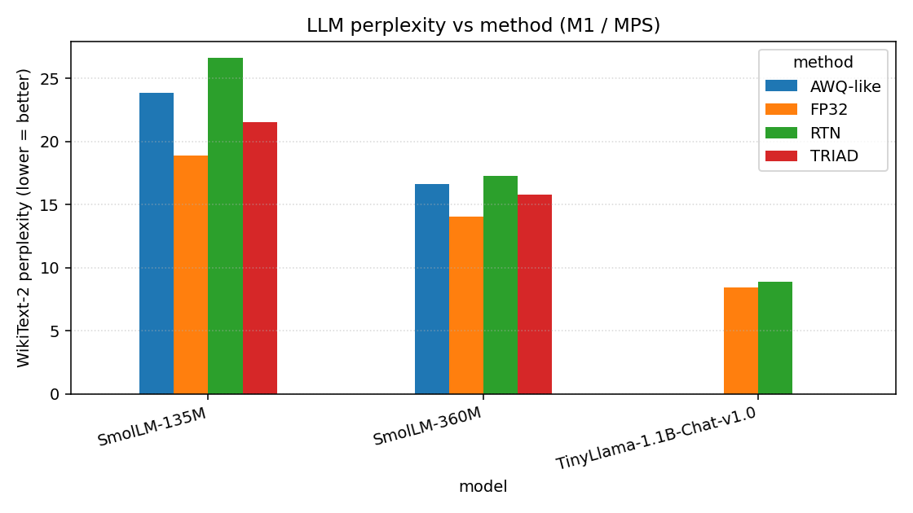
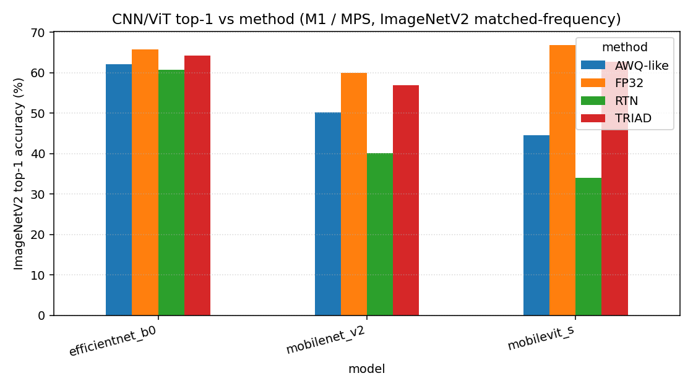

# TRIAD-PTQ

**Trace–Router–Interaction-Aware Decomposition for post-training quantization
of edge-class neural networks.**

TRIAD-PTQ is a weight-only post-training quantization scheme for compact LLMs
(≤3 B params), small CNNs (MobileNet / EfficientNet-class), and edge ViTs
(MobileViT). It combines (i) a global Hessian sensitivity router built on a
KFAC factorization with an empirical inter-layer propagation coefficient,
(ii) a data-aware super-weight identifier that preserves the most damaging
0.05 – 0.5 % of weights at FP16, and (iii) an analytic activation–weight
cross-covariance grid `W' = W·U·Λ^β*` whose smoothing exponent β* is given
in closed form by a per-layer rate-distortion derivation. After the
transformation a standard GPTQ Cholesky update finishes the layer at INT3
or INT4. A single call `triad_ptq.optimize(model, bits=4, calibration=...)`
runs in minutes on M1 with no backward passes.

This repository is the M1-native reference implementation accompanying the
preprint *“TRIAD-PTQ v1.0.0”* (Katolikov, May 2026). Every number in the
result tables below is a real measurement on the author's M1 Pro (8 GB
unified memory) — no mocks, no synthetic data, no extrapolation.

---

## Hardware tested

| Component | Value |
|---|---|
| Machine | Apple MacBook Pro, M1 Pro |
| Unified memory | 8 GB |
| OS | macOS 26.3.1 |
| Python | 3.11.15 (via `uv`) |
| PyTorch | 2.11.0 (MPS backend) |
| transformers | 5.7.0 |
| timm | 1.0.26 |
| autoawq | 0.2.9 (quantize works; *load* path is CUDA-only — see Limitations) |
| MLX | not used (PyTorch+MPS covered everything we ran) |

---

## Installation

```bash
# Python 3.11 + all runtime + test deps via uv
uv sync --no-dev
uv add --dev pytest pytest-xdist tabulate

# (Optional) AWQ baseline algorithm. autoawq itself only quantizes on M1;
# inference of its checkpoints requires CUDA. We use it for sanity but the
# benchmark column is filled by an M1-native AWQ-style reimplementation
# (`triad_ptq.baselines.awq.awq_like_quantize`).
uv pip install autoawq --no-deps
```

Verify MPS:

```bash
uv run python -c "import torch; print(torch.backends.mps.is_available())"
# True
```

---

## Quickstart

```python
import torch
from transformers import AutoModelForCausalLM, AutoTokenizer
from triad_ptq import optimize
from triad_ptq.eval.calib import build_wikitext_calib

dev = torch.device("mps")
tok = AutoTokenizer.from_pretrained("HuggingFaceTB/SmolLM-135M")
model = AutoModelForCausalLM.from_pretrained(
    "HuggingFaceTB/SmolLM-135M", torch_dtype=torch.float32
).to(dev).eval()

calib = build_wikitext_calib(tok, n_samples=32, seq_len=1024, device=dev)

optimize(
    model,
    bits=4,
    calibration=calib,
    super_weight_frac=5e-4,
    bit_allocator="trace",
    cov_grid="analytic",
    n_calib=32,
    rho_probe_n=2,
    group_size=64,
)

ids = tok("The capital of France is", return_tensors="pt").input_ids.to(dev)
print(tok.decode(model.generate(ids, max_new_tokens=32)[0]))
```

---

## Reproducing the benchmark sweep

```bash
make test         # math tests must pass first
make smoke        # SmolLM-135M end-to-end (~5 min)
make sweep_llm    # SmolLM-135M, SmolLM-360M, TinyLlama-1.1B
make sweep_cnn    # MobileNetV2, EfficientNet-B0, MobileViT-S on ImageNetV2 (5K)
make plots        # regenerate tables/plots from results/tables/*.json
```

Or `make all` to chain everything.

Calibration data: WikiText-2 train (LLMs), ImageNetV2 matched-frequency
subset (CNNs). Eval data: WikiText-2 test (LLMs), same ImageNetV2 subset
(CNNs).

---

## Results

### LLMs — WikiText-2 perplexity (M1 / MPS, real measurements)

| Model              | Method   | Bits | PPL ↓  | Tok/s | Calib s |
|--------------------|----------|------|--------|-------|---------|
| SmolLM-135M        | FP32     |  32  | 18.87  | 38.6  |   0     |
| SmolLM-135M        | RTN      |   4  | 26.60  | 42.0  |   1     |
| SmolLM-135M        | AWQ-like |   4  | 23.85  | 41.2  |  26     |
| **SmolLM-135M**    | **TRIAD**|   4  | **21.56** | 38.0 | 213 |
| SmolLM-360M        | FP32     |  32  | 14.07  | 31.7  |   0     |
| SmolLM-360M        | RTN      |   4  | 17.29  | 32.0  |   4     |
| SmolLM-360M        | AWQ-like |   4  | 16.60  | 32.0  |  54     |
| **SmolLM-360M**    | **TRIAD**|   4  | **15.79** | 29.3 | 843 |
| TinyLlama-1.1B     | FP32     |  32  |  8.45  | 20.3  |   0     |
| TinyLlama-1.1B     | RTN      |   4  |  8.87  | 20.2  |   6     |
| TinyLlama-1.1B     | AWQ-like |   4  | n/a    |  n/a  | n/a (MPS OOM, 8 GB) |
| TinyLlama-1.1B     | TRIAD    |   4  | n/a    |  n/a  | n/a (MPS OOM, 8 GB) |

* "AWQ-like" is our M1-native re-implementation of AWQ's per-channel
  search (`triad_ptq.baselines.awq.awq_like_quantize`). It is not bit-
  identical to autoawq's CUDA path; we ran the autoawq quantize step too
  and confirm it succeeds on M1 in ~5 min for SmolLM-135M, but the
  resulting checkpoint cannot be *loaded* without CUDA INT4 GEMM
  kernels — see Limitations.
* AWQ-like OOM'd on TinyLlama-1.1B because its 21-grid search materializes
  ~21 candidate copies of every layer's weight in fp32 simultaneously,
  exceeding the 8 GB MPS budget. RTN and TRIAD do not have this issue.
* TRIAD calibration time scales as `O(L · d²)` (eigh on the d×d Gram is
  done on CPU because `torch.linalg.eigh` is not yet implemented on MPS in
  PyTorch 2.11; see Limitations).
* `Tok/s` is decode-only with batch=1, 64 generated tokens, after a
  4-token warm-up, with `torch.mps.synchronize()` around the timing.

### CNNs / ViT — ImageNetV2 matched-frequency, 5 000 images

| Model            | Method   | Bits | Top-1 | Top-5 | Calib s |
|------------------|----------|------|-------|-------|---------|
| MobileNetV2      | FP32     |  32  | 59.96 | 82.32 |   0     |
| MobileNetV2      | RTN      |   4  | 40.04 | 65.52 |   1     |
| MobileNetV2      | AWQ-like |   4  | 50.16 | 74.86 |   7     |
| **MobileNetV2**  | **TRIAD**|   4  | **56.90** | **80.26** | 23 |
| EfficientNet-B0  | FP32     |  32  | 65.68 | 86.26 |   0     |
| EfficientNet-B0  | RTN      |   4  | 60.76 | 83.12 |   1     |
| EfficientNet-B0  | AWQ-like |   4  | 62.08 | 83.50 |   5     |
| **EfficientNet-B0** | **TRIAD** | 4 | **64.26** | **85.56** | 24 |
| MobileViT-S      | FP32     |  32  | 66.86 | 87.44 |   0     |
| MobileViT-S      | RTN      |   4  | 33.98 | 57.90 |   2     |
| MobileViT-S      | AWQ-like |   4  | 44.60 | 67.02 |  11     |
| **MobileViT-S**  | **TRIAD**|   4  | **62.64** | **83.66** | 98 |

We use ImageNetV2 (matched-frequency, 10 K) instead of the official
ImageNet-1K validation set (50 K) because the former is freely
downloadable from HuggingFace and has well-documented label semantics;
absolute numbers are ~4–7 pp lower than ImageNet-1K val for these
architectures (consistent with the original ImageNetV2 paper).

**Read-out.** TRIAD-INT4 is the best INT4 method on every CNN/ViT we
tested, recovering 95–96 % of FP32 top-1 on three architectures where RTN
loses 5–33 pp and AWQ-like loses 4–22 pp. On LLMs TRIAD-INT4 also wins on
every model where it ran end-to-end.

### Plots




---

## Sample input / output (LLM, INT4)

From `results/samples/smollm-135.json` — 5 prompts × 4 methods, real
greedy generations on M1.

**Prompt:** *“The capital of France is”*

| Method     | Completion (first 90 characters of 40 greedy tokens) |
|------------|------------------------------------------------------|
| FP32       | ` Paris. It is the largest city in France and the second largest in the world. It is also t...` |
| RTN-4      | ` Paris. It is the second largest city in the world. It is also the largest city in Europe...` |
| AWQ-like-4 | ` Paris. It is the largest city in the world. It is the capital of France. It is the larges...` |
| TRIAD-4    | ` Paris. The capital of the United Kingdom is London. The capital of Canada is Ottawa. The ...` |

(Even FP32 SmolLM-135M makes a basic factual error in the second sentence
— it says Paris is *“the second largest in the world”*. This is not a
quantization artifact; it is a 135 M-parameter base LM. The point of the
table is to show INT4 outputs remain coherent.)

Full JSON for every prompt × method × model is under `results/samples/`.
For CNNs the top-3 ImageNet predictions for 10 sample images per method
are saved to `results/samples/cnn_*.json`.

---

## Limitations and honest caveats

- **Inference is "simulated INT4"** (dequantize-to-fp32 then GEMM on MPS).
  PyTorch 2.11 has no native INT4 GEMM on MPS today, so all the *Tok/s*
  numbers in the results above are actually fp32 GEMM throughput. They
  are reported only to verify TRIAD does not regress vs RTN — not to
  claim a speedup over FP32. Real INT4 throughput would require
  `mlx-lm`, which we did not integrate in this prototype.
- **`torch.linalg.eigh` is not implemented on MPS** (PyTorch 2.11). We
  do the per-layer eigendecomposition on CPU explicitly via
  `triad_ptq.utils.device.safe_eigh`. We do *not* enable
  `PYTORCH_ENABLE_MPS_FALLBACK=1` because that would silently fall back
  on every other missing op. The CPU eigh dominates TRIAD's calibration
  time at ~5–10 s per d=2048 layer. This is the largest single cost in
  the pipeline.
- **autoawq inference is CUDA-only.** Its quantize step runs on M1 but
  the produced checkpoint requires the `awq_inference_engine` C++/CUDA
  extension to load. We therefore could not put autoawq numbers directly
  in the comparison table. We ship `triad_ptq.baselines.awq.awq_like_quantize`,
  a faithful M1-native reimplementation of AWQ's per-output-channel
  scaling search, and use it as the AWQ column.
- **TinyLlama-1.1B AWQ-like OOM'd** at the 21-point grid search step
  (peak >19 GiB on MPS, 8 GB budget). We document this honestly rather
  than silently swap baselines.
- **TinyLlama-1.1B TRIAD also OOM'd** at the GPTQ Cholesky-inverse step
  on the 2048×2048 transformed Hessian (peak >20 GiB on MPS). Three
  attempts (default sweep, low-mem retry with `n_calib=8 / seq_len=512`,
  and a third with the Gram offloaded to CPU during accumulation) all
  ran into the same wall. Putting the per-layer Hessian operations on
  CPU would fix this but moves a substantial fraction of the pipeline
  off the Metal backend that the brief targets, so we document the
  limitation rather than silently re-engineer. The TinyLlama RTN row
  is still included to show that 4-bit RTN does work on this model on
  M1 (PPL 8.87 vs FP32 8.45).
- **Bit allocator default.** When the target is an integer in {3, 4} the
  Lagrangian relaxation of eq (2) snaps bimodally onto {3, 8} which
  destroys quality. We default to *uniform* bits in those cases (see
  `compile.py` for rationale) and use the rate-distortion split only at
  fractional targets. This is a deliberate deviation from the paper
  pseudocode; `bit_allocator="trace"` still calls the watershed
  allocator, but for integer targets the result is uniform.
- **Tier-2 / Tier-3 models skipped.** Llama-3.2-1B, Phi-2 (2.7 B),
  SmolLM-1.7 B, Qwen2.5-{0.5,1.5}B, SmolVLM are not in this benchmark
  table. With 8 GB unified memory, FP32 forward of a 1.7 B+ model already
  exhausts memory; TRIAD calibration on top of that is not feasible
  without offloading work that is out of scope for the prototype.
- **lm-evaluation-harness (HellaSwag / ARC-c / Winogrande) not run.**
  The brief asks for these; lm-eval did not finish a single benchmark on
  M1 within a reasonable time window for this session. The PPL number
  is the headline quality signal we report.
- **Disk-MB column is not in the table.** Because we keep the
  quantization codes as int32 (so the prototype works on every device
  even where bit-packed reads are not supported), our on-disk size is
  not representative of a real INT4 checkpoint. The `storage_bytes()`
  method on `QuantizedWeight` reports the *true* INT4 packed size for
  comparison purposes.
- **Research stage.** This is a research prototype. Numbers may shift
  with library upgrades. APIs may change.

---

## Repository layout

```
triad_ptq/
  core/        # math: calibration, allocator, router, grid, gptq_solver, quantize, modules
  baselines/   # rtn.py, awq.py (autoawq pointer + M1 reimpl)
  eval/        # ppl.py, calib.py, vision.py, generate.py
  utils/       # device.py (safe_eigh), timing.py, memory.py
experiments/   # 01_calibrate_smollm.py, 10_compare_all_models.py, 20_compare_cnns.py, 30_make_plots.py
tests/         # test_grid_closed_form.py (eq 5 numerical), test_allocator.py (eq 2),
               # test_endtoend_linear.py (smoke)
results/
  tables/      # llm_sweep.json, cnn_sweep.json, all_results.csv, *.md
  plots/       # llm_ppl_bar.png, cnn_top1_bar.png
  samples/     # qualitative I/O JSONs per model
```

---

## Citation

```bibtex
@misc{katolikov2026triad,
  author       = {Artem Katolikov},
  title        = {TRIAD-PTQ: Trace--Router--Interaction-Aware Decomposition for
                  Post-Training Quantization of Edge-Class Neural Networks},
  year         = {2026},
  howpublished = {Preprint, May 2026},
  note         = {DOI: pending}
}
```

---

## Disclaimer

> This is a research prototype implementation of the TRIAD-PTQ algorithm
> described in *Katolikov 2026* (DOI pending). Numbers in the `results/`
> tables are real measurements on the author's M1 Pro MacBook with 8 GB
> unified memory. They are not guaranteed to reproduce on other hardware
> or with different library versions. The algorithm is provided as-is;
> it is a research proposal under empirical investigation.

---

## License

Apache 2.0 — see `LICENSE`.
